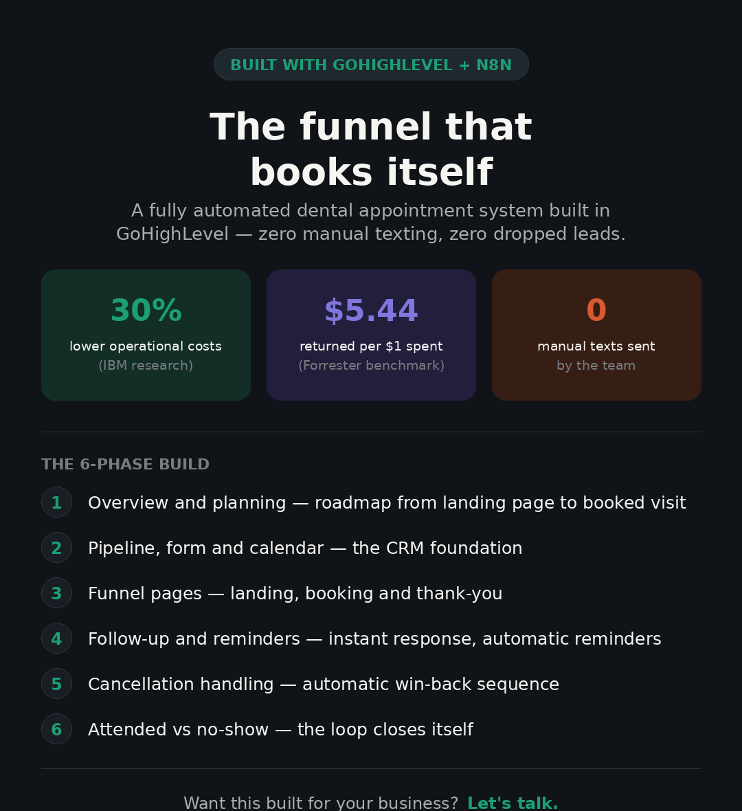
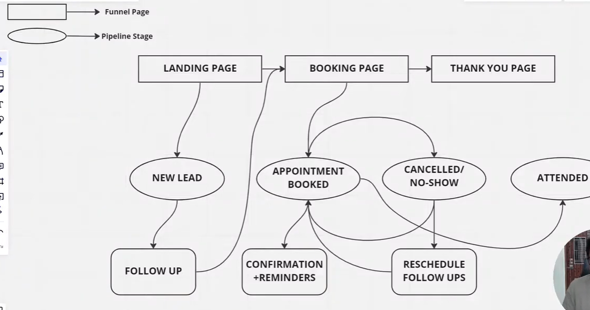
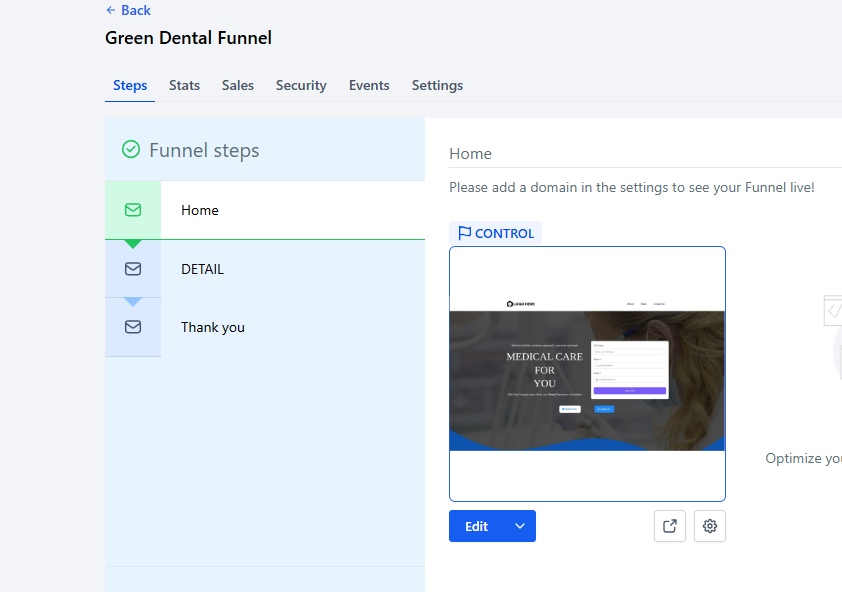
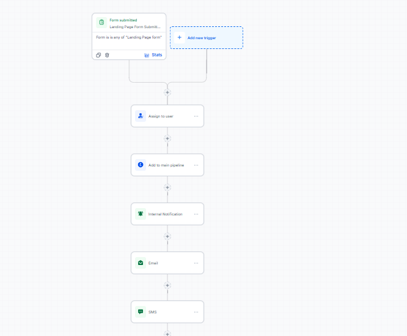
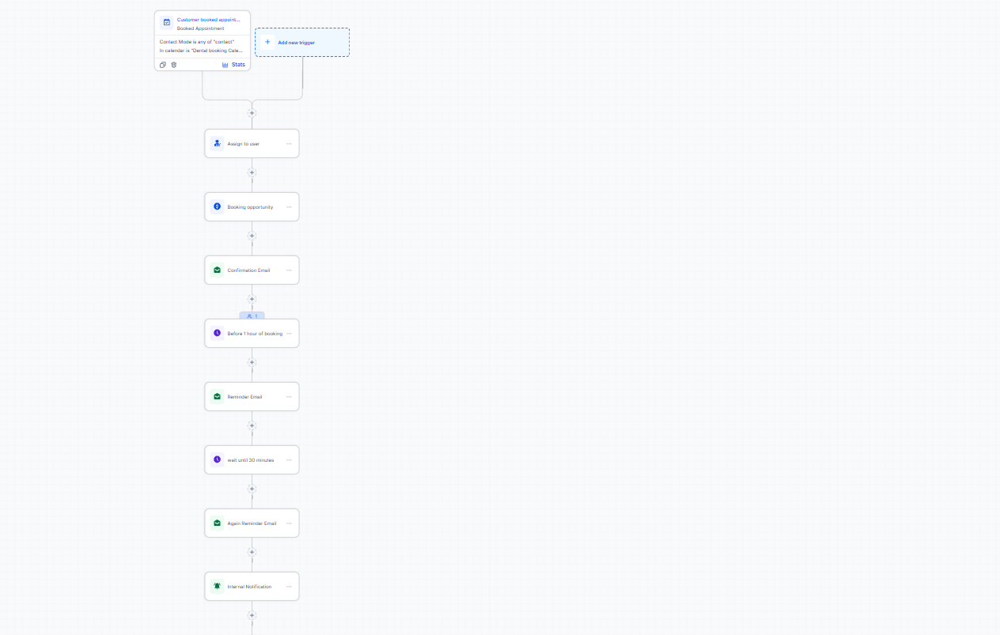
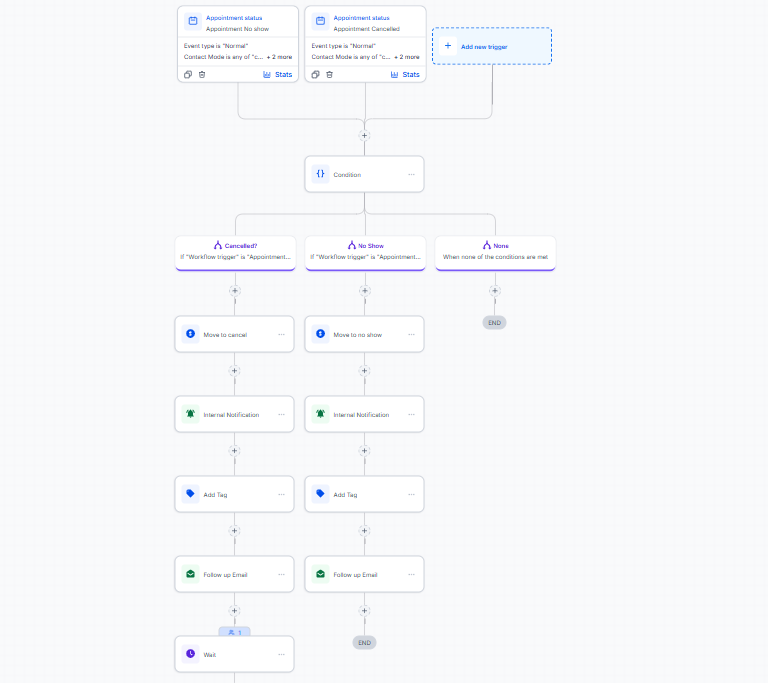
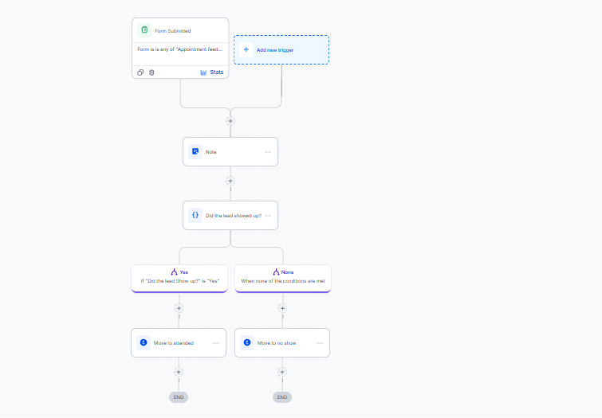

# 🦷 GHL Dental Appointment Funnel — Full Automation Build

A fully automated, no-manual-texting appointment funnel for a dental practice, built entirely inside **GoHighLevel (GHL)**. Leads land on a page, book their own appointment, get reminded automatically, and get sorted into "attended" or "no-show" without a single person touching the pipeline.



---

## 📊 Why this matters

| Metric | Value | Source |
|---|---|---|
| Lower operational cost from automating engagement | **up to 30%** | IBM research |
| Return per $1 spent on automated workflows | **$5.44** (top quartile: $8.71) | Forrester Wave benchmarking |
| Manual texts required to run this funnel | **0** | — |

Manual follow-up is where leads die. This repo documents a system built to close that gap completely — instant response, automatic reminders, automatic re-engagement, automatic pipeline sorting.

---

## 🎥 Video walkthrough (build series)

The full build is broken into 6 parts. Watch in order to reproduce the system from scratch:

| # | Title |
|---|---|---|
| 1 | Overview & Planning |
| 2 | Creating Pipeline, Form, and Calendar |
| 3 | Creating Funnel Pages |
| 4 | Setup Follow-Ups & Booking Confirmation + Reminders |
| 5 | Appointment Cancelled & No-Show Automation |
| 6 | Handling No-Show/Attended Bookings Automatically |

---

## 🗺️ System architecture



**Legend:** rectangles = funnel pages, ellipses = pipeline stages.

The prospect flows **Landing Page → Booking Page → Thank You Page**, while the backend simultaneously moves their contact record through **New Lead → Appointment Booked → Cancelled/No-Show → Attended**, triggered entirely by form submissions, calendar events, and wait-timers — no manual dragging of pipeline cards.

---

## 🧩 Build phases

### 1. Overview & planning
Strategic roadmap of the full prospect journey (landing page → booking → thank-you) and every backend automation that needs to fire at each phase, planned before a single page was built.

### 2. Pipeline, form & calendar setup
Core CRM configuration completed before any visual page work:
- **Pipeline** — a "Main Pipeline" with 5 stages: `New Lead`, `Appointment Booked`, `Cancelled`, `No Show`, `Attended`
- **Form** — lead capture form collecting Name, Email, Phone
- **Calendar** — "Dental Appointment Booking" calendar with 1-hour slots, scheduling notice windows, and active business hours

### 3. Funnel pages
Three-page funnel built in GHL's site builder:



- **Landing page** — embeds the lead capture form
- **Booking page** — embeds the calendar
- **Thank-you page** — confirms the booking

### 4. Follow-up, booking confirmation & reminders

**Landing page workflow** — fires the instant a form is submitted:



- Assigns the lead to a team member
- Moves the contact to `New Lead`
- Sends an internal notification
- Emails the prospect a direct booking link

**Booking workflow** — fires when a calendar slot is selected:



- Updates pipeline stage to `Appointment Booked`
- Sends an instant confirmation email with a cancellation link
- Uses `Wait` steps to auto-send reminders at **24 hours** and **2 hours** before the appointment

### 5. Cancellation & no-show automation



If a prospect clicks the cancellation link from their reminder, this workflow:
- Instantly updates their stage to `Cancelled`
- Triggers a re-engagement sequence to win the booking back
- Runs the same logic for detected no-shows, with internal notifications and tagging on both branches

### 6. Attended vs. no-show handling



Closes the loop post-appointment:
- Leads are automatically filtered and moved to `Attended` after a successful visit
- No-shows are automatically routed into a dedicated win-back campaign
- Zero manual drag-and-drop of contacts between stages

---

## 🛠️ Tech stack

- **GoHighLevel (GHL)** — CRM, pipeline, funnel pages, workflows, SMS/email
- **n8n** *(optional layer, used in extended versions of this system)* — matching/orchestration engine for multi-property or multi-buyer setups

---

## 📁 Repo structure

```
ghl-dental-funnel-automation/
├── README.md
├── assets/
│   ├── poster.png
│   └── screenshots/
│       ├── 01-funnel-steps.png
│       ├── 02-attendance-workflow.png
│       ├── 03-landing-page-workflow.png
│       ├── 04-cancellation-noshow-workflow.png
│       ├── 05-booking-confirmation-workflow.png
│       └── 06-system-architecture-diagram.png
└── docs/
    └── build-guide.md
```

---

## 🚀 Getting started

This repo is documentation/reference for a GHL-native build — there's no code to install. To reproduce it:

1. Watch the video series above in order (1 → 6).
2. In your GHL sub-account, recreate the pipeline, form, and calendar from Phase 2.
3. Build the 3-page funnel from Phase 3.
4. Recreate each workflow shown in the screenshots above — trigger, conditions, and actions are visible in each diagram.
5. Test with a dummy lead through the full cycle: submit → book → remind → cancel/attend.

---

## 📩 Contact

Want this system built or adapted for your business? Open an issue or reach out directly.

#GoHighLevel #MarketingAutomation #CRM #LeadGeneration #SalesFunnel
